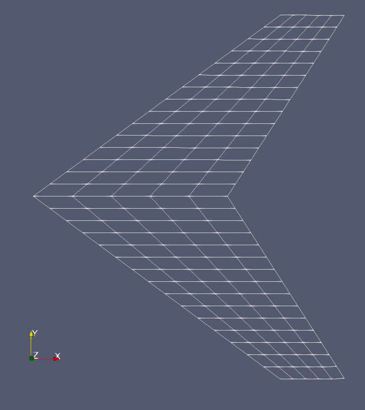
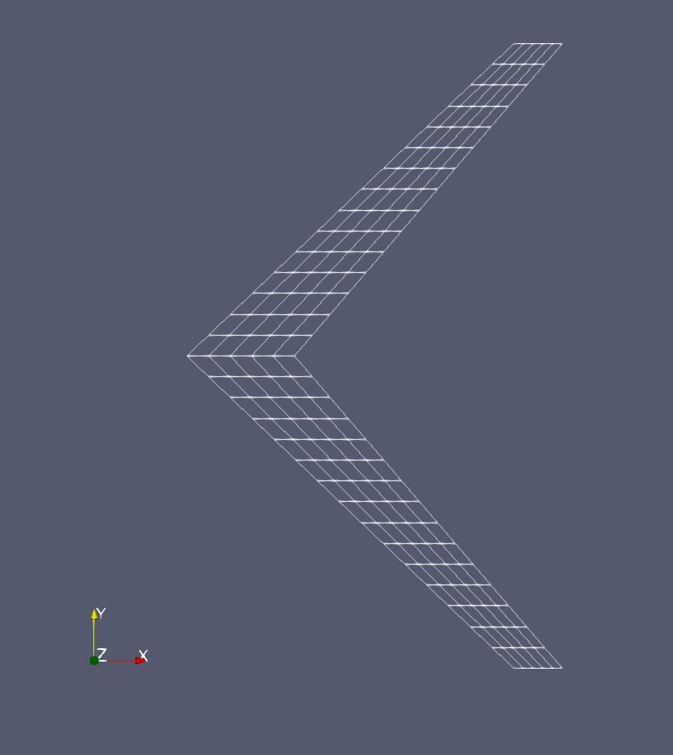

# fourPointWing
Program to generate an uncambered wing lattice given four corner points.    
Twist, sweep and taper of the wing may be incorporated in the vertices provided as input.   

# Usage
The four vertices of the semispan are to be input in-code.  
The code may be compiled and executed using the Makefile provided using the command  
`make`  
The output is in PLOT3D, ASCII, non-multigrid, double precision format.  

# Examples
Sample wings created using the program and rendered in Paraview  
  
  

## Authors
All code here was created by [Cibin Joseph](https://github.com/cibinjoseph) (cibinjoseph92@gmail.com).

# License
MIT License
See [LICENSE](LICENSE) for full text.
